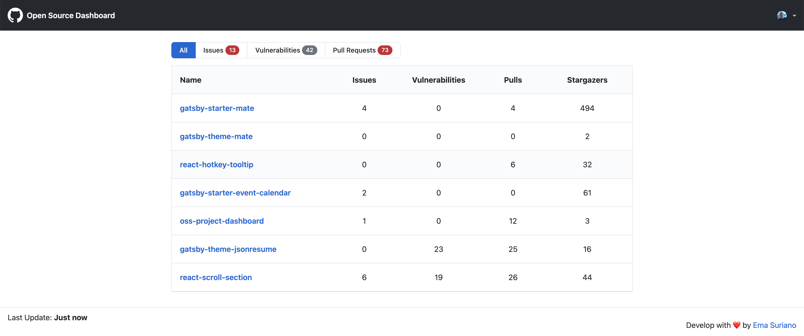
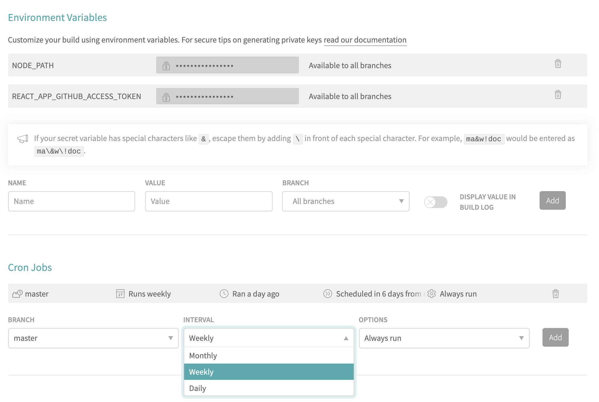

# Open Source Github Dashboard

[](https://app.netlify.com/sites/oss-dashboard/deploys)

> Quick overview of all your Open Sources projects in Github ✨

**[Live app][app-link]**

## What does it include? 📦

- Components based on [Primer UI](https://primer.style/components/).
- Simple login with Github
- GraphQL API Github
- Project list powered by Github Gist

This project can be used in two ways:

- Login directly inside the [live app][app-link]. See [Basic setup](#basic-setup).
- Host your own dashboard in order to showcase your maintained projects to others. See [Host your own Dashboard](#host-your-own-dashboard).

## Screenshots 🖼



## Basic setup ⚙️

### Requirements 📝

- [Github](https://github.com/) account.
- A list of projects inside Github to monitor (can be private or public).

### Steps 🏃‍♂️

1. Go to [Github Gists](https://gist.github.com/).
2. Create a new file with the name of `oss-projects.json`.
3. Inside the content of the file add a plain list containing the name of the project that you want to add to the dashboard. Example:

```json
{
  "projects": ["MyUser/project-a", "MyUser/project-b", "AnotherUser/project-c"]
}
```

4. Open [live app][app-link] and click on Log in with Github.
5. Accept permissions and you should be able to see the dashboard with the information of your projects ✨

## Host your own Dashboard 🙆‍♂️

The main difference with the [live app][app-link] is that login is not needed anymore in order to see the projects and there is no logout option. You can check [my Open Source Dashboard](https://oss.emasuriano.com) ✨

Benefits of following this approach:

- You can showcase your projects to other by simply sharing a link, because your user is already _logged in_.
- Setting alerts when the amount of pull requests or issues are more than expected. Please check [Setting alerts](#setting-automatic-alerts) for more information.

### Steps 🏃‍♂️

1. Go to your [Github Developer Settings](https://github.com/settings/tokens), create a new Auth token and copy its content.
2. Fork the project or make use of [Use Template](https://help.github.com/en/github/creating-cloning-and-archiving-repositories/creating-a-repository-from-a-template) feature in Github.
3. Create a `.env` file in the root of the project with the following information

```text
REACT_APP_GITHUB_ACCESS_TOKEN=<<REPLACE_WITH_YOUR_TOKEN>>
```

1. Install dependencies by running `yarn` and then `yarn start` to start the server.

NIT: This project is using `react-scripts` v2, which can build your project and export a static website, so you can easily deploy it anywhere! I recommend building it with [Netlify](http://netlify.com/) because it provides a nice set of tools and it has a great integration with Github.

### Setting automatic alerts

⚠️ WIP ⚠️

Oh great, you decided to host your own Open Source Dashboard 💪 One of the great advantages is that you can set up periodically builds with any CI (Travis, CircleCI, etc.) which will check can if the amount of Pull Requests or Issues is greater than your expected. Ideal for maintainers with several projects. At the moment, this feature only check the **total amount** of both values.

In this case I'm using [Travis CI](https://travis-ci.com/) to run the automatic tests.

Steps:

1. Add the property `threshold` into your `oss-projects.json` with the properties of `pullRequests` and `issues`.

```json
{
  "projects": ["MyUser/project-a", "MyUser/project-b", "AnotherUser/project-c"],
  "threshold": {
    "pullRequests": 10,
    "issues": 5
  }
}
```

2. Add your project to travis and add the same environment variables as in the previous step: `NODE_PATH` and `REACT_APP_GITHUB_ACCESS_TOKEN`
3. Set up Cron job to run the time you want, I recommend to run it every week.



## Contribution 💪

I'm always open for Pull Requests and Issues, so don't be afraid of collaborating!

## License 📝

MIT.

[app-link]: https://oss-dashboard.netlify.com
