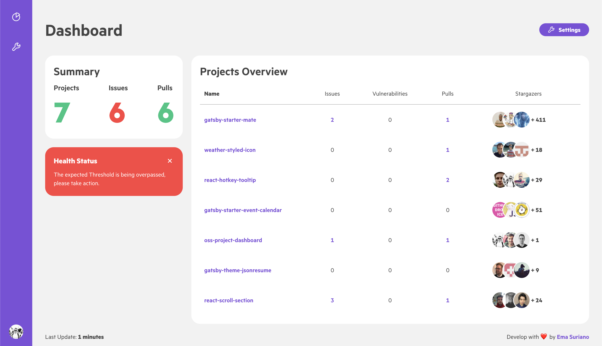

# Open Source Github Dashboard

[](https://app.netlify.com/sites/oss-dashboard-emasuriano/deploys)

> Dashboard to have a quick overview of Open Sources projects in your Github account ✨

This project is based on [Argon Dashboard React](https://github.com/creativetimofficial/argon-dashboard-react).

**[Live demo](https://oss-dashboard.netlify.com)**

## What does it include?

- Responsive Design
- Github API
- Easy setup
- Project list configuration

## Screenshots

| Viewport | Image                          |
| -------- | ------------------------------ |
| Desktop  |  |
| Tablet   |    |
| Mobile   |    |

## Configuration

1. Create a `.env` file at the root level with the following structure

```text
NODE_PATH=./src
REACT_APP_GH_TOKEN=YOUR_GITHUB_ACCESS_TOKEN
```

2. Change the name of the project inside the [projects.js](https://github.com/EmaSuriano/oss-project-dashboard/blob/master/src/projects.js). They need to be the same as the URL in Github: `https://github.com/USER_NAME/PROJECT_NAME`

3. Install dependencies by running `yarn` and then `yarn start` to start the server.

NIT: This project is using `react-scripts` v2, which can build your project and export a static website, so you can easily deploy it anywhere!

## License

MIT.
