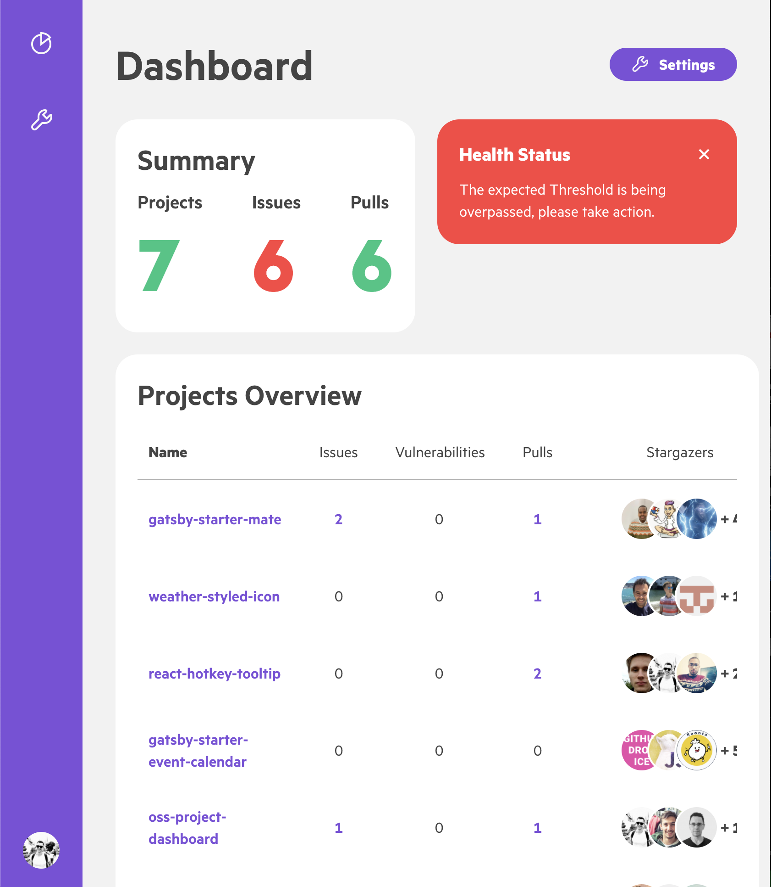

# Open Source Github Dashboard

[](https://app.netlify.com/sites/oss-dashboard-emasuriano/deploys)

<div align="center">
  <a href="https://react-hotkey-tooltip.netlify.com/#/">
    
  </a>
</div>

<div align="center">
  <strong>A Dashboard to have a quick overview of Open Sources projects in your Github account ✨</strong>
</div>

Powered by [Argon Dashboard⚛️](https://github.com/creativetimofficial/argon-dashboard-react).

**[Live demo ✨](https://oss-dashboard.netlify.com)**

## What does it include? 📦

- Responsive Design
- Github API
- Easy setup
- Project list configuration

## Screenshots 🖼

| Desktop                        | Tablet                       | Mobile                       |
| ------------------------------ | ---------------------------- | ---------------------------- |
|  |  |  |

## Configuration 🛠

1. Create a `.env` file at the root level with the following structure

```text
NODE_PATH=./src
REACT_APP_GH_TOKEN=YOUR_GITHUB_ACCESS_TOKEN
```

2. Change the name of the project inside the [projects.js](https://github.com/EmaSuriano/oss-project-dashboard/blob/master/src/projects.js). They need to be the same as the URL in Github: `https://github.com/USER_NAME/PROJECT_NAME`

3. Install dependencies by running `yarn` and then `yarn start` to start the server.

NIT: This project is using `react-scripts` v2, which can build your project and export a static website, so you can easily deploy it anywhere!

## Features

### Component Shadowing out of the box 🤯

Inside the Webpack configuration I setup `enhanced-resolve` that allows to reference an alias with one or more possible directories. This is the key that I was looking for because it allows the same feature as in Gatsby of `shadowing`.

The way it works is:

You set the plugin alias by modifying the plugins inside the Webpack configuration.

```javascript
config.resolve.plugins = [
  new AliasPlugin(
    'described-resolve',
    [
      {
        name: 'components',
        alias: ['src/components', 'node_modules/my-dep/src/components'],
      },
    ],
    'resolve',
  ),
];
```

Then, inside the code you require a resource, can be `.js`, `.css`, or a `.png` image.

```javascript
import MyCoolComponent from 'components/myCoolComponent`;

export default () => <MyCoolComponent />
```

The plugin will first look into the first alias provided, my local `src` folder, if the file is present then it will require that one. Otherwise it will go to the next alias, until the chain ends.

This feature is quite handy when you are working with templates like `argon-dashboard-react`.

## Contribution 💪

I'm always open for Pull Requests and Issues, so don't be afraid of collaborating!

In case you are interested in the project this is the current [Roadmap 🛣](./ROADMAP.md) of features and bug!

## License 📝

MIT.
